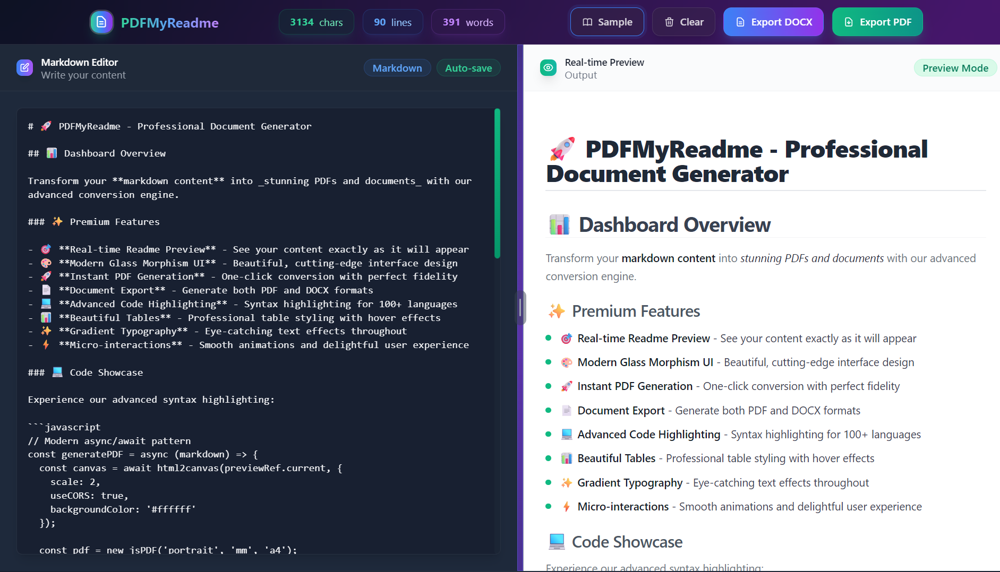

# 📄 PDFMyReadme - Transform Markdown to PDF & DOCX



A beautiful, modern web application that converts README files and Markdown documents into professional-looking PDF and DOCX documents instantly. Real-time preview, modern design, and perfect formatting for documentation, portfolios, and reports.


## ✨ Features

- 🎨 **Beautiful Modern UI** - Clean, responsive design with Tailwind CSS
- 📝 **Markdown Support** - Handles headings, lists, bold text, and code blocks
- 📄 **Professional PDFs** - Well-formatted output with proper typography
- � **DOCX Export** - Convert to Microsoft Word documents
- �🚀 **Fast & Reliable** - Built with Next.js 15 and TypeScript
- 🔄 **Real-time Preview** - Live markdown preview as you type
- 📱 **Responsive Design** - Works perfectly on desktop and mobile
- 🎯 **Error Handling** - Comprehensive error states and loading indicators
- 🎪 **Sample Content** - Built-in sample markdown to get started quickly
- 🌐 **No Registration Required** - Use instantly without signing up
- 💰 **Free to Use** - Completely free online tool

## 🚀 Getting Started

### Prerequisites

- Node.js 18+
- npm, yarn, pnpm, or bun

### Installation

1. Clone the repository:

```bash
git clone https://github.com/maitrekpatel/pdfmyreadme.git
cd readme_to_pdf_converter
```

2. Install dependencies:

```bash
npm install
# or
yarn install
# or
pnpm install
```

3. Run the development server:

```bash
npm run dev
# or
yarn dev
# or
pnpm dev
```

4. Open [http://localhost:3000](http://localhost:3000) in your browser

## 🎯 Usage

1. **Enter Text**: Paste your README content or any markdown text into the textarea
2. **Try Sample**: Click "Load Sample" to see an example of formatted content
3. **Generate PDF/DOCX**: Choose between PDF or DOCX format and click generate
4. **Download**: Click the download button to save your generated document

### Supported Markdown Features

- `# Heading 1` - Large headings
- `## Heading 2` - Medium headings  
- `### Heading 3` - Small headings
- `**Bold text**` - Bold formatting
- `- List items` - Bullet points
- `` ```code``` `` - Code blocks
- Line breaks and paragraphs

## 🛠️ Tech Stack

- **Framework**: [Next.js 15](https://nextjs.org/) with App Router
- **Language**: [TypeScript](https://www.typescriptlang.org/)
- **Styling**: [Tailwind CSS 4](https://tailwindcss.com/)
- **PDF Generation**: [PDFKit](https://pdfkit.org/)
- **DOCX Generation**: [docx](https://www.npmjs.com/package/docx)
- **Linting**: ESLint with Next.js config

## 📁 Project Structure

```text
src/
├── app/
│   ├── api/
│   │   ├── generate-pdf/
│   │   │   └── route.ts          # PDF generation API endpoint
│   │   └── generate-doc/
│   │       └── route.ts          # DOCX generation API endpoint
│   ├── globals.css               # Global styles and Tailwind imports
│   ├── layout.tsx                # Root layout component
│   └── page.tsx                  # Main page component
└── components/
    └── NoSSR.tsx                 # Client-side rendering wrapper
```

## 🔧 API Reference

### POST `/api/generate-pdf`

Generates a PDF from the provided text content.

### POST `/api/generate-doc`

Generates a DOCX document from the provided text content.

**Request Body:**

```json
{
  "text": "Your markdown content here..."
}
```

**Response:**

- **Success**: PDF/DOCX file as binary stream
- **Error**: JSON with error message

## 🎨 Customization

### Styling

- Modify `src/app/globals.css` for global styles
- Update Tailwind classes in components for UI changes
- Colors and spacing can be adjusted in the component files

### PDF Formatting

- Edit `src/app/api/generate-pdf/route.ts` to customize:
  - Font sizes and colors
  - Margins and spacing
  - Page layout
  - Markdown parsing logic

### DOCX Formatting

- Edit `src/app/api/generate-doc/route.ts` to customize:
  - Document styles
  - Paragraph formatting
  - Header and footer options
  - Markdown to DOCX conversion

## 🤝 Contributing

Contributions are welcome! Please feel free to submit a Pull Request. For major changes, please open an issue first to discuss what you would like to change.

1. Fork the project
2. Create your feature branch (`git checkout -b feature/AmazingFeature`)
3. Commit your changes (`git commit -m 'Add some AmazingFeature'`)
4. Push to the branch (`git push origin feature/AmazingFeature`)
5. Open a Pull Request

## 📝 License

This project is open source and available under the [MIT License](LICENSE).

---

**🌐 Website**: [https://pdfmyreadme.maitrekpatel.tech](https://pdfmyreadme.maitrekpatel.tech)

Made with ❤️ for the developer community by [Maitrek Patel](https://maitrekpatel.tech)
